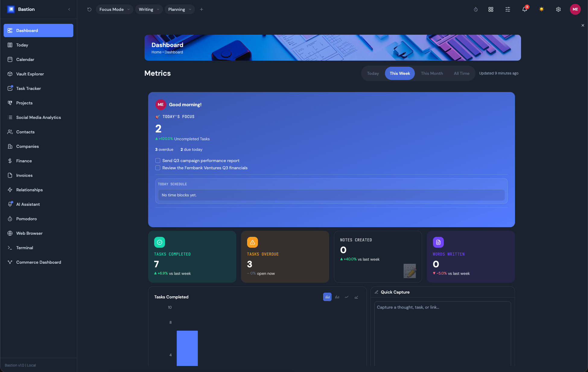

# Bastion for Obsidian

Bastion turns your Obsidian vault into a full command center — AI search, tasks,
projects, a calendar, and dashboards — without asking you to restructure a
single note. Everything reads from and writes back to plain Markdown files
already in your vault.

Learn more, and start a 14-day free trial, at **[getbastion.app](https://www.getbastion.app)**.

**This plugin is closed source.** This repository distributes compiled
releases only — see [LICENSE](LICENSE).

## Features

- **Dashboard** — customizable widget grid (drag/resize/hide), per-widget backgrounds, chart-type switching
- **Today / Planning Surface** — daily planning view, task scheduling
- **Vault Explorer** — browse, read, and edit notes without leaving the dashboard
- **AI Assistant** — chat against your vault's own content, 7 providers
- **Calendar** — month/week/day views, synced from Google, Apple, or Microsoft/Exchange
- **Task Tracker** — synced from 12 sources (Todoist, Apple Reminders, Asana, ClickUp, Jira, Linear, Monday.com, Trello, GitHub Issues, Google Tasks, Microsoft To Do, TickTick)
- **Projects** — kanban boards, gantt timelines, progress tracking
- **Pomodoro** — timers with real Flowtime (open-ended) mode, idle detection, task linking
- **Finance** *(Pro)* — wallets, budgets with rollover, savings goals, upcoming bills, month-to-month trends, insights
- **Commerce Dashboards** *(Pro)* — multi-instance store analytics (Etsy, Stripe, Shopify, Gumroad, Lemon Squeezy), each with its own layout
- **Invoices** — create, template, and print-to-PDF, right from the vault
- **Social Media Analytics** *(Pro)* — engagement/follower tracking across YouTube, Instagram, Facebook, X, TikTok, Dribbble
- **Contacts / Companies / Relationships** *(Pro)* — a lightweight CRM synced from Google/Apple/Exchange contacts
- **Web Browser** — an in-app browser tab for research without leaving the dashboard
- **Terminal** — a real PTY-backed terminal panel, not a fake console

Multiple panels can be docked side-by-side (desktop), with saved workspace presets
(Focus Mode, custom layouts) and full light/dark theming.

## Installing

### Option 1 — Community Plugins (recommended)

1. In Obsidian, open **Settings → Community plugins → Browse**, and search for **Bastion**.
2. Click **Install**, then **Enable**.

### Option 2 — Manual install

1. Download `main.js`, `manifest.json`, and `styles.css` from the [latest release](https://github.com/nerdsanddragons/bastion-obsidian-plugin/releases/latest).
2. Create a folder named `bastion` inside your vault's `.obsidian/plugins/` folder.
3. Copy the three downloaded files into that folder.
4. In Obsidian, go to **Settings → Community plugins**, reload, and enable **Bastion**.

## Getting a subscription

Bastion needs a Bastion account to unlock Plus/Pro features. Sign up or start
your trial at [getbastion.app/pricing](https://www.getbastion.app/pricing),
then use **Settings → Bastion → Sign in to Bastion** inside the plugin to
connect it.

## Support

Help Center: [getbastion.app/help](https://www.getbastion.app/help)
